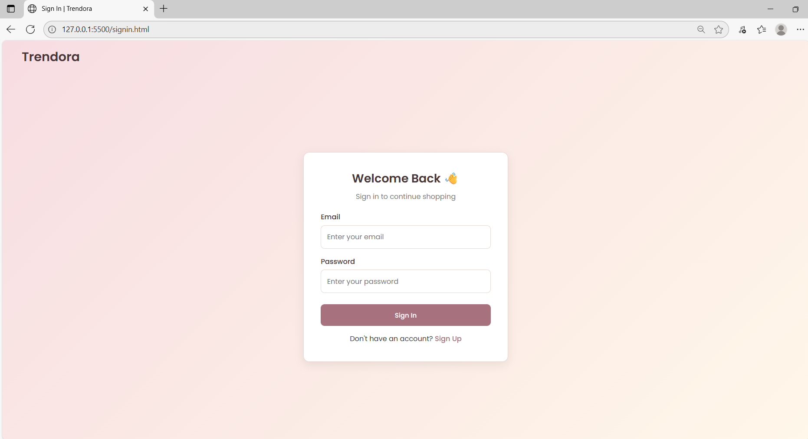
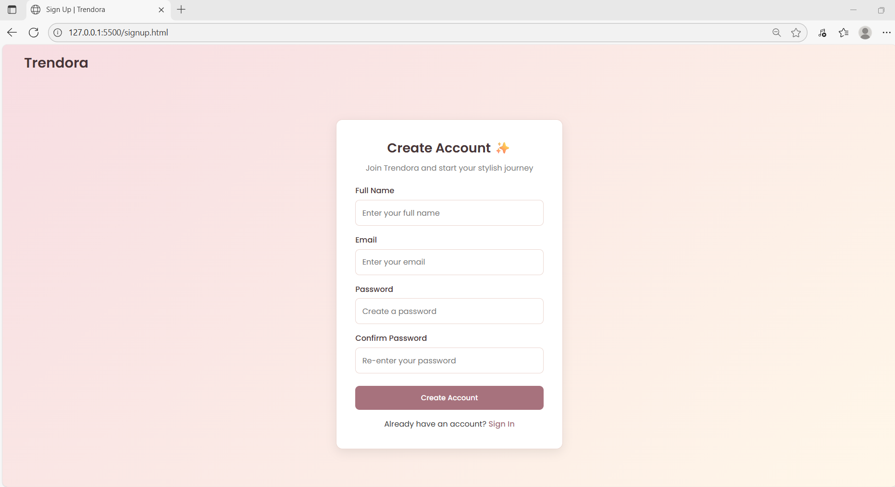
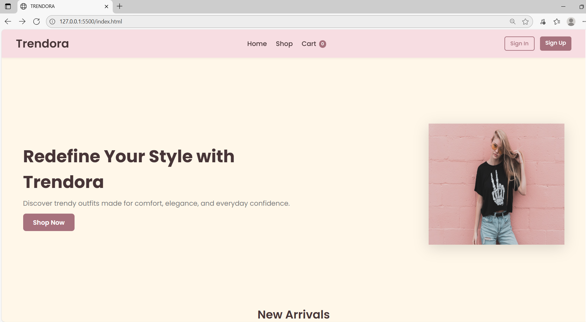
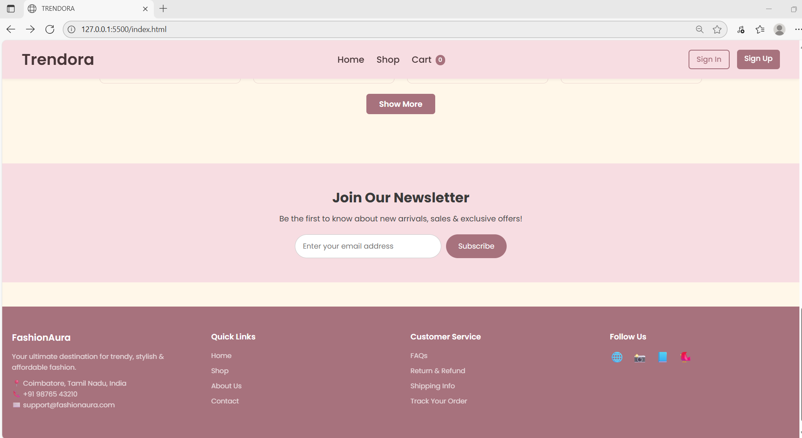
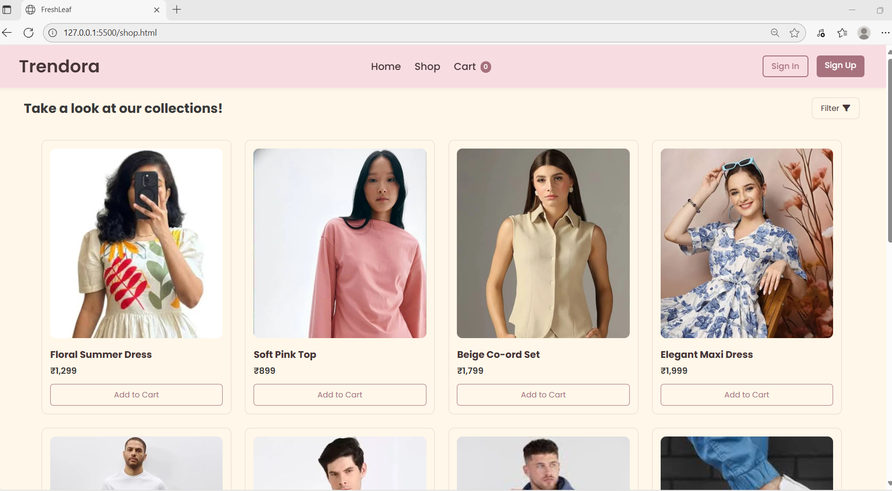
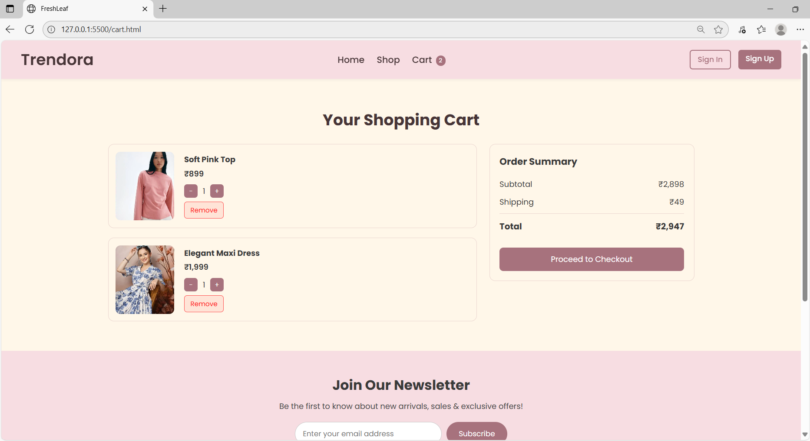

# Trendora - Fashion E-commerce Website

## 🌟 Overview

Trendora is a modern and stylish fashion e-commerce website designed to provide users with a seamless shopping experience. It features category browsing, trending products, discounts, an add-to-cart system, and a responsive user-friendly UI.

## ✨ Features

* 🛍️ Modern and clean UI/UX design
* 👗 Category-based product browsing (Men, Women, Kids, Accessories)
* 🔥 Trending fashion products section
* 🛒 Add to Cart functionality
* 📱 Fully responsive design for all devices
* 🎨 Smooth animations and hover effects
* 🌐 Built using only HTML, CSS, and JavaScript

## 🧰 Tech Stack

| Technology           | Purpose                              |
| -------------------- | ------------------------------------ |
| HTML5                | Structure of the webpages            |
| CSS3                 | Styling, layout, responsiveness      |
| JavaScript (Vanilla) | Interactivity & cart functionalities |

## 📂 Project Structure

```
Trendora/
│
├── index.html 
|--- shop.html
|--- cart.html 
|--- signup.html
|--- signin.html
|--- auth.css      
├── style.css         
├── script.js         
├── assets/           
│   ├── images/
│   
└── README.md
```


### ✅ Prerequisites

You only need a browser to run this project. *(No backend required)*

### ▶️ Run Locally

```bash
# Clone the repository

https://github.com/KeerthanaAnandhan/trendora-ecommerce-website.git

# Open index.html in your browser
```

## 📸 Screenshots







## 🧪 Demo (Optional)

After deployment, add demo link here:
https://gregarious-tiramisu-b719d0.netlify.app/
```
🔗 Live Demo: 
```

## 🛠️ Future Enhancements

Here’s what can be added next:
* 🛍️ Product detail page
* 🔎 Product search and filters
* 💳 Payment gateway integration
* 🛗 Convert to React / Tailwind version
* 📦 Backend integration with Node.js + MongoDB

## 🤝 Contributing

Contributions are always welcome!
If you want to contribute:

```bash
1. Fork this repo
2. Create a new branch
3. Commit changes
4. Create a Pull Request
```

## 🏆 Author

**Keerthana Anandhan**
Passionate Frontend Developer & UI/UX Enthusiast

## ⭐ Show Your Support

If you like this project, support by ⭐ starring the repo!

```
⭐ Star this repo if you found it helpful!
```

